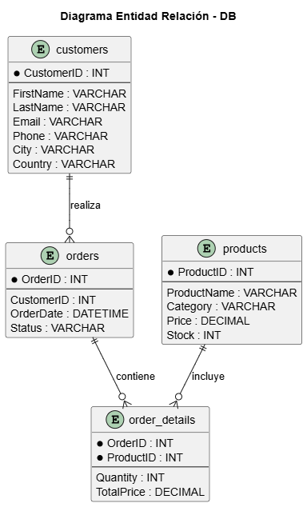
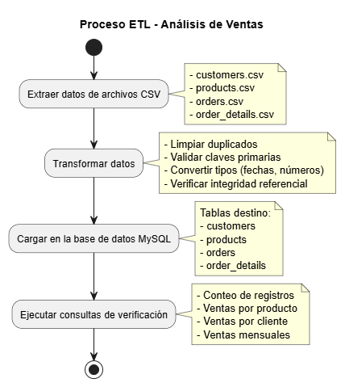

# 📊 Sistema de Análisis de Ventas con Proceso ETL

[](https://www.python.org/)
[](https://www.mysql.com/)

Este proyecto implementa un **pipeline ETL completo** para consolidar información de clientes, productos, pedidos y detalles de pedidos a partir de archivos CSV.  
Los datos son procesados y cargados en una base de datos **MySQL**, permitiendo realizar análisis posteriores como ventas por producto, ventas por cliente y ventas mensuales.

---

## 📂 Estructura del proyecto
```
ETL-AnalisisVentas/
├── data/ # Archivos CSV de entrada
│ ├── customers.csv
│ ├── products.csv
│ ├── orders.csv
│ └── order_details.csv
├── docs/ # Documentación y diagramas
│ ├── DiagramaER.png
│ ├── DiagramaFlujoETL.png
│ └── screenshots/ # Evidencias y capturas de pantalla
│ ├── count_customers.png
│ ├── count_orders.png
│ └── consultas.png
├── notebooks/
│ └── ETL-AnalisisVentas.ipynb # Notebook Jupyter con el pipeline ETL
│ └── ETL-ExportadoAnalisisVentas.py # Exportacion del script Python del notebook pipeline ETL
├── scripts/
│ └── create_sales_db.sql # Script SQL de creación de la BD y tablas
├── requirements.txt # Dependencias del proyecto
└── README.md # Documentación del proyecto
```

---

## 1️⃣ Modelado de la Base de Datos

Se diseñaron las siguientes tablas principales:

- **customers**
  - `CustomerID` (PK)
  - `FirstName`, `LastName`, `Email`, `Phone`, `City`, `Country`

- **products**
  - `ProductID` (PK)
  - `ProductName`, `Category`, `Price`, `Stock`

- **orders**
  - `OrderID` (PK)
  - `CustomerID` (FK → customers.CustomerID)
  - `OrderDate`, `Status`

- **order_details**
  - `OrderID` (FK → orders.OrderID)
  - `ProductID` (FK → products.ProductID)
  - `Quantity`, `TotalPrice`
  - PK compuesta (`OrderID`, `ProductID`)

📌 El modelo completo está representado en el **diagrama entidad–relación (ER)**:  


---

## 2️⃣ Proceso ETL

El pipeline se desarrolló en **Python (Jupyter Notebook)** con las siguientes fases:

### 🔹 Extracción
- Lectura de los archivos CSV:  
  `customers.csv`, `products.csv`, `orders.csv`, `order_details.csv`.

### 🔹 Transformación
- Eliminación de duplicados.
- Relleno de valores nulos básicos (ejemplo: categoría desconocida, email vacío).
- Conversión de tipos de datos: fechas, enteros y decimales.
- Validación de integridad referencial (que los pedidos tengan clientes válidos, y los detalles correspondan a productos existentes).
- Manejo de duplicados en `order_details` mediante agregación de `Quantity` y `TotalPrice`.

### 🔹 Carga
- Inserción de datos procesados en las tablas MySQL creadas con `create_sales_db.sql`.
- Uso de inserciones optimizadas (`chunksize`, `multi-insert`) para tablas grandes.

📌 El flujo está documentado en el siguiente **diagrama ETL**:  


---

## 3️⃣ Instalación

```bash
# Clonar el repositorio
git clone https://github.com/Alb3rtsonTL/ETL-AnalisisVentas.git
cd ETL-AnalisisVentas

# Crear entorno virtual (opcional pero recomendado)
python -m venv venv
source venv/bin/activate   # Linux/Mac
venv\Scripts\activate      # Windows

# Instalar dependencias
pip install -r requirements.txt
```

---

## 4️⃣ Resultados esperados

1. **Script SQL:**  
   - [`scripts/sales_db.sql`](scripts/sales_db.sql) crea la base de datos `sales_db` y sus tablas.

2. **Pipeline ETL en Python:**  
   - [`notebooks/ETL-AnalisisVentas.ipynb`](notebooks/ETL-AnalisisVentas.ipynb) implementa todo el proceso de extracción, transformación y carga.

3. **Documentación y diagramas:**  
   - Diagramas ER y de flujo ETL en [`docs/`](docs/).

4. **Evidencias:**  
   - Capturas de pantalla con el conteo de registros en cada tabla.  
   - Resultados de consultas (`SELECT * FROM ... LIMIT 10`).  

5. **Consultas de prueba (KPIs):**
   - Ventas totales por producto.
   - Ventas totales por cliente.
   - Ventas agrupadas por mes.

---
## 5️⃣ Consultas KPIs en MySQL:

```sql
-- Ventas totales por producto
SELECT p.ProductID, p.ProductName, SUM(od.TotalPrice) AS TotalSales
FROM order_details od
JOIN products p ON p.ProductID = od.ProductID
GROUP BY p.ProductID, p.ProductName
ORDER BY TotalSales DESC;

-- Ventas totales por cliente
SELECT c.CustomerID, CONCAT(c.FirstName,' ',c.LastName) AS CustomerName, SUM(od.TotalPrice) AS TotalSpent
FROM orders o
JOIN order_details od ON o.OrderID = od.OrderID
JOIN customers c ON c.CustomerID = o.CustomerID
GROUP BY c.CustomerID, CustomerName
ORDER BY TotalSpent DESC;

-- Ventas mensuales
SELECT DATE_FORMAT(o.OrderDate, '%Y-%m') AS YearMonth, SUM(od.TotalPrice) AS TotalSales
FROM orders o
JOIN order_details od ON o.OrderID = od.OrderID
GROUP BY YearMonth
ORDER BY YearMonth;
